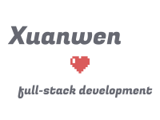

# JSXML Portfolio Site (React)

<!-- PROJECT LOGO -->
 

  

  <h3 align="center">Xuanwen Zheng's Portfolio</h3>

<!-- TABLE OF CONTENTS -->

  
Table of Contents

  <ol>
    <li>
      <a href="#about-the-project">About The Project</a>
      <ul>
        <li><a href="#built-with">Built With</a></li>
        <li><a href="#website-link">Website Link</a></li>
      </ul>
    </li>
    <li>
      <a href="#available-scripts">Available Scripts</a>
    </li>
    <li><a href="#license">License</a></li>
    <li><a href="#contact">Contact</a></li>
  </ol>

<!-- ABOUT THE PROJECT -->
## About The Project

This project is Xuanwen Zheng's Portfolio Site that display my basic information about my self introduction, skills, educations, work experience, projects, blogs by using React. It uses the JSON APIs which Austin Caron and I created in the PHP course (Laravel backend), retrieves the data, and uses that in the React site. 

(<a href="#top">back to top</a>)

### Built With

* [React](https://reactjs.org/)
* [Bootstrap](https://getbootstrap.com)
* [Vercel](https://vercel.com/)

(<a href="#top">back to top</a>)

### Website Link

[Xuanwen Zheng's Portfolio](https://jsxml-portfolio-site.vercel.app/)

(<a href="#top">back to top</a>)

<!-- AVAILABLE SCRIPTS -->
## Available Scripts

In the project directory, you can run:

### `npm start`

Runs the app in the development mode.\
Open [http://localhost:3000](http://localhost:3000) to view it in your browser.

The page will reload when you make changes.\
You may also see any lint errors in the console.

### `npm test`

Launches the test runner in the interactive watch mode.\
See the section about [running tests](https://facebook.github.io/create-react-app/docs/running-tests) for more information.

### `npm run build`

Builds the app for production to the `build` folder.\
It correctly bundles React in production mode and optimizes the build for the best performance.

The build is minified and the filenames include the hashes.\
Your app is ready to be deployed!

See the section about [deployment](https://facebook.github.io/create-react-app/docs/deployment) for more information.

### `npm run eject`

**Note: this is a one-way operation. Once you `eject`, you can't go back!**

If you aren't satisfied with the build tool and configuration choices, you can `eject` at any time. This command will remove the single build dependency from your project.

Instead, it will copy all the configuration files and the transitive dependencies (webpack, Babel, ESLint, etc) right into your project so you have full control over them. All of the commands except `eject` will still work, but they will point to the copied scripts so you can tweak them. At this point you're on your own.

You don't have to ever use `eject`. The curated feature set is suitable for small and middle deployments, and you shouldn't feel obligated to use this feature. However we understand that this tool wouldn't be useful if you couldn't customize it when you are ready for it.

(<a href="#top">back to top</a>)

<!-- LICENSE -->
## License

Distributed under the MIT License.

(<a href="#top">back to top</a>)

<!-- CONTACT -->
## Contact

Xuanwen Zheng: xuanwen1101@outlook.com

Project Link: [https://github.com/Xuanwen1101/PassionProject-Movie](https://github.com/Xuanwen1101/PassionProject-Movie)

(<a href="#top">back to top</a>)

